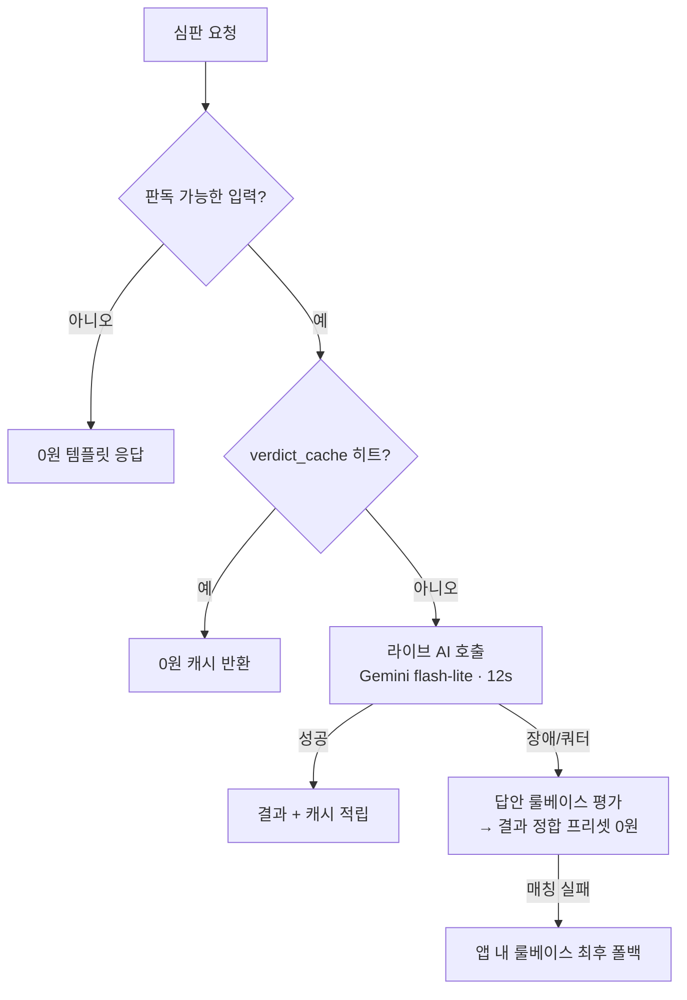
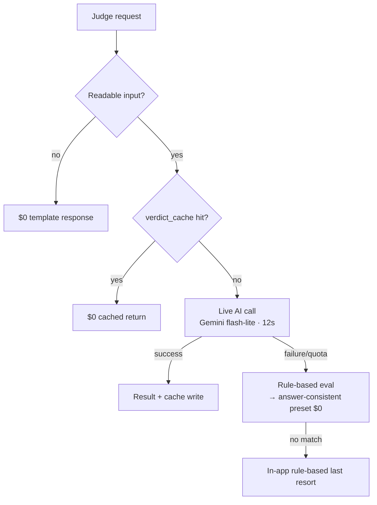

<!-- ZunaTtang / 주나 — Profile README -->
<!-- 정량 지표 TODO: 아래 <!--metric--> 표시된 곳에 실제 숫자(주당 절감 시간, 테스터 수 등)를 넣으면 더 강해집니다. -->

# 주나 (Zuna)

### AI 자동화 빌더 · Product / Growth Ops Engineer

저는 **AI를 "답변기"가 아니라, 사람의 판단이 필요한 지점을 아는 운영 시스템의 일부로 설계**합니다.
언제 자동화하고, 언제 멈춰 사람에게 물어야 하는지를 시스템 안에 녹입니다.

> **그 한 예** — 모바일 게임 *운명재판소*는 AI 판정이 실패하면 `캐시 → 룰베이스 프리셋(0원) → 앱 내 최후 폴백`으로 자동 강등됩니다.
> **AI가 어디서 막혀도 게임은 멈추지 않고**, 그래서 *"판당 흑자"*(광고수익 > AI 원가)가 유지됩니다.

---

## 대표 작업 3가지

**1. 운명재판소 (Court of Destiny)** — AI 판관이 생사를 판정하는 바이럴 모바일 게임.
다계층 AI 라우팅으로 **호출 단가를 ≈ ₩0까지 붕괴**, 응답 **12초 → 1.5초**, 사건 **683건** 운영, Google Play 비공개 테스트 중.
&nbsp;&nbsp;↳ `Court-of-Destiny` *(비공개 — 아키텍처는 아래 다이어그램 참고)*

**2. ClientBrief** — GitHub 활동(PR·Issue·Review)을 비개발자용 **주간 리포트로 자동 생성**하는 풀스택 SaaS.
Next.js 14 · Prisma · 멀티테넌트 · `draft→approved→sent` 승인 워크플로우까지 **혼자 설계·구현**.
&nbsp;&nbsp;↳ [`clientbrief`](https://github.com/ZunaTtang/clientbrief)

**3. Web QA Judge 파이프라인** — Playwright 크롤 한 번으로 빌드 간 회귀를 탐지하고,
**의심 케이스만 Claude가 최종 판정**해 자동화의 고질병인 오탐/노이즈를 사람 대신 걸러냄. CI에 종료코드(0/1/2) 반환.
&nbsp;&nbsp;↳ `qa-automation` *(비공개 — 데모 요청 가능)*

---

## AI를 어떻게 다루나

단순히 "AI를 써봤다"가 아니라, **생성 → 운영 → 판단 → 도구 조작 → 비용 설계**까지 전 스펙트럼을 실제 프로덕션에 넣었습니다.

| 레벨 | 무엇 | 내 사례 |
|---|---|---|
| **비용 엔지니어링** | AI 단가를 제품 경제성에 맞춰 설계 | 운명재판소 — 다계층 폴백 라우팅으로 호출 단가 ≈ ₩0, *"판당 흑자"* 유지 (provider 추상화로 Gemini↔Claude Haiku 스왑) |
| **판단 레이어** | AI가 의사결정을 내림 | QA 파이프라인의 **Claude Code Judge** — 회귀 의심 케이스만 판정, 오탐을 사람 대신 필터 |
| **도구 조작 (MCP)** | AI가 실제 업무 시스템을 직접 조작 | **Intercom·Slack·Notion MCP** — 오픈 문의 정리·답변 초안·공지 멘트 생성 |
| **스케줄 운영** | AI를 정기 운영 루틴에 탑재 | **Claude Code Routines** — 서버리스 인프라 0으로 매일 CS 다이제스트 발행 |
| **생성 + 전사** | 콘텐츠·음성 처리 | Claude API 시장 브리핑 · **Whisper(faster-whisper)** 자막 전사 |

> 그리고 이 시스템들을 **Claude Code로 직접 빌드**합니다. AI를 ① 제품 안에 넣고 ② 그걸 만드는 데도 씁니다.

---

## 대표 프로젝트 상세

### 운명재판소 (Court of Destiny) — AI 판관 바이럴 모바일 게임
> 황당한 위기 + 물품 2개가 주어지면 플레이어가 생존 계획을 쓰고, AI 판관이 드라마틱하게 생사를 판정. Google Play 비공개 테스트 가동 중.

- **스택:** Expo (React Native) · Supabase (Edge Functions · Postgres · 익명 Auth) · Gemini flash-lite *(provider 추상화 — Anthropic Haiku 스왑 가능)* · AdMob · RevenueCat
- **AI 비용 엔지니어링(핵심):** *"판당 흑자"*를 위해 AI 호출 단가를 0원에 근접하게 붕괴시키는 다계층 라우팅. **어디서 막혀도 게임이 멈추지 않음.**
- **무인 운영 설계:** 콘텐츠=DB / 로직=OTA / 네이티브=고정 **3단 분리**로 스토어 재심사 최소화 · 서버 권위 토큰 캡으로 바이럴 적자 방어 · 사건 **683건** 운영
- **혼자 end-to-end:** 앱 · 백엔드 · DB · 토큰경제 · 광고 · 결제 · 스토어 배포까지

**비용 방어 라우팅 (코드는 비공개, 구조는 공개):**

↳ `Court-of-Destiny` *(비공개 / 데모 요청 가능)*

### ClientBrief — 비개발자용 주간 개발 리포트 SaaS
> GitHub PR · Issue · Review · Comment 데이터를 비개발자도 읽기 쉬운 주간 리포트로 자동 생성하고, 검토 → 승인 → 이메일 발송까지 처리.

- **스택:** Next.js 14 (App Router) · React 18 · TypeScript 5 · PostgreSQL · Prisma 5 · NextAuth.js · Tailwind · Zod
- **핵심:** GitHub OAuth 수집 · 민감정보 자동 마스킹(`[REDACTED]`) · AI 7섹션 리포트 · `draft → approved → sent` 상태 머신 · Resend 발송 · 멀티 테넌트
- **임팩트:** "이번 주 뭐 했는지"를 매주 손으로 정리하던 시간을 제거. <!--metric: "주당 약 N시간 절감"을 확인해 채우면 강해짐-->

↳ [`clientbrief`](https://github.com/ZunaTtang/clientbrief)

### Web QA 자동화 도구 — Claude Code Judge 회귀 탐지 파이프라인
> Playwright + TypeScript 재사용 QA 도구. 범용 헬스체크부터 빌드 간 회귀를 자동 탐지하고 Claude로 노이즈를 걸러내는 파이프라인까지.

- **스택:** Playwright · TypeScript · Claude Code (Judge) · 로컬 GUI
- **2계층:** ① 범용 QA(smoke/regression/crawler/visual/a11y) — 대상 URL만 바꾸면 어떤 사이트든 ② 회귀 탐지 — 페이지를 구조적으로 스냅샷(접근성 트리·API 스키마·콘솔/네트워크·픽셀)하고 baseline과 비교, **의심 케이스만 Claude 판정**, CI에 종료코드(0/1/2)
- **임팩트:** 수동 QA를 반복 가능한 운영 품질 게이트로 전환. AI를 회귀 탐지의 판단 레이어로 통합.

↳ `qa-automation` *(비공개 / 데모 요청 가능)*

### Intercom Daily Digest Routine — AI CS 운영 루틴
> 매일 오전 Intercom의 열린 대화를 요약·분류해 Slack에 발행하는 Claude Code Routine.

- **스택:** Claude Code Routines · Intercom MCP · Slack MCP · Sonnet 4.6
- **핵심:** 미할당/봇 대화 필터 → 우선순위 분류(긴급/조치/대기/모니터) → Slack Block Kit
- **엔지니어링 판단:** AWS Lambda + EventBridge → Routine 이관으로 운영 부담↓·보안↑(루트 크리덴셜·수동 배포 제거)

↳ [`intercom-digest-routine`](https://github.com/ZunaTtang/intercom-digest-routine)

### Live Archiver — 어려운 CLI를 내 입맛대로 만든 yt-dlp GUI
> 링크만 붙여넣고 "시작"을 누르면 라이브를 처음부터 아카이빙하는 브라우저 GUI. 강력하지만 쓰기 어려운 `yt-dlp` CLI를 내가 실제로 쓰기 편한 도구로 재설계.

- **스택:** Python · JavaScript · Whisper(faster-whisper) · yt-dlp / ffmpeg 래핑
- **핵심:** OS별 **자동 설치**(제로 셋업) · YouTube `--live-from-start` · **1700+ 사이트** · 정지/복구 조각 처리 · faster-whisper 전사(GPU→CPU 폴백·이어하기 → SRT/TXT)
- **의미:** "쓰기 어려운 CLI를 내 워크플로우에 맞는 GUI로 바꾼다" — 사용성을 직접 설계하는 **DX/UX 감각**.

↳ [`ytdlp-live-gui`](https://github.com/ZunaTtang/ytdlp-live-gui)

> **그 외:** Tap-to-Sync — 숏폼 자막 싱크 MVP(React, SRT/LRC/CapCut 내보내기, [`taptosync`](https://github.com/ZunaTtang/taptosync)) · Crypto Briefing Bot — 시장 데이터 → Claude API 해석 → Telegram 발송([`briefing-bot`](https://github.com/ZunaTtang/briefing-bot)) · Web Screenshot Autobot — 로그인 지원 BFS 크롤러([`auto-screenshot-bot`](https://github.com/ZunaTtang/auto-screenshot-bot))

---

## 핵심 역량

**AI & 자동화**
`Claude Code (Judge/Routines)` · `Claude API` · `Gemini` · `OpenAI API` · `Whisper 전사` · `MCP (Notion·Intercom·Slack)` · `AI 비용 최적화·다계층 라우팅` · `Human-in-the-loop 설계`

**프로덕트 & 그로스 옵스**
`캠페인 운영` · `유저 행동 분석` · `CRM/CS 워크플로우` · `CS 문의 반자동 응대` · `퍼널 모니터링` · `그로스 실험` · `커뮤니티 자동화`

**기술 스택**
`TypeScript` · `Python` · `React / Next.js` · `React Native / Expo` · `Node.js` · `Supabase (Edge Functions·Postgres)` · `PostgreSQL / Prisma` · `SQLite` · `Google Apps Script` · `Playwright` · `Docker` · `GCP` · `REST / Webhook`

**운영 자동화 도구 (내부 사용)**
`Notion DB → 공지 멘트 자동 초안` · `Intercom 오픈 문의 → Slack 일일 관리 + 답변 초안` · `SQLite 경량 데이터 레이어` · `Apps Script로 거래소 API·DEX RPC 자산 집계 → 스프레드시트 자동 정리`

---

## 일하는 방식

좋은 자동화 시스템은 코드 그 이상입니다. **누가 쓰는가 · 어떤 의사결정을 돕는가 · 실패는 어떤 모습인가 · 사람은 결과를 어떻게 검토하는가 · 자동화가 언제 멈추고 판단을 요청해야 하는가** — 이 다섯을 먼저 설계합니다.

그래서 저는 **운영을 이해하는 개발(operation-aware development)** 을 지향합니다. 실제 팀 워크플로우 안에서 동작하는 작은 시스템.

> **한 줄 요약:** 프로덕트·그로스 팀이 수동 병목 없이 더 빠르게 움직이도록, AI 기반 운영 시스템을 만듭니다.

---

## 연락처

- GitHub: [@ZunaTtang](https://github.com/ZunaTtang)

---
---

# Zuna

### AI Automation Builder · Product / Growth Ops Engineer

I design **AI not as an "answer box," but as part of an operational system that knows where human judgment is needed** — when to automate, and when to stop and ask.

> **One example** — my mobile game *Court of Destiny* auto-downgrades when an AI verdict fails: `cache → rule-based preset ($0) → in-app last resort`.
> **The game never stalls, wherever the AI breaks** — which keeps it *"profitable per play"* (ad revenue > AI cost).

I turn messy, repetitive operations into measurable, reusable automation, working at the intersection of **product, growth, operations, and engineering**.

---

## Top 3 Projects

**1. Court of Destiny** — a viral mobile game where an AI judge rules life or death.
Multi-tier AI routing **collapses call cost to ≈ $0**, response **12s → 1.5s**, **683 live scenarios**, in Google Play closed testing.
&nbsp;&nbsp;↳ `Court-of-Destiny` *(private — see the architecture diagram below)*

**2. ClientBrief** — a full-stack SaaS that **auto-generates non-engineer-friendly weekly reports** from GitHub activity (PR·Issue·Review).
Next.js 14 · Prisma · multi-tenant · a `draft→approved→sent` workflow — **designed and built solo**.
&nbsp;&nbsp;↳ [`clientbrief`](https://github.com/ZunaTtang/clientbrief)

**3. Web QA Judge pipeline** — one Playwright crawl detects cross-build regressions, and **only suspicious cases go to Claude for the final verdict**, filtering automation's classic false-positive noise. Returns CI exit codes (0/1/2).
&nbsp;&nbsp;↳ `qa-automation` *(private — demo on request)*

---

## How I Work With AI

Not "I tried an AI" — I've shipped the full spectrum to production: **generation → ops → judgment → tool operation → cost design.**

| Level | What | My case |
|---|---|---|
| **Cost engineering** | Engineering AI unit cost to fit product economics | Court of Destiny — multi-tier fallback routing keeps call cost ≈ $0, *"profitable per play"* (provider-abstracted Gemini↔Claude Haiku) |
| **Judgment layer** | AI makes the decision | **Claude Code Judge** in the QA pipeline — verdicts only on suspected regressions, filtering false positives for the human |
| **Tool operation (MCP)** | AI operates real business systems | **Intercom·Slack·Notion MCP** — triages tickets, drafts replies, drafts announcements |
| **Scheduled ops** | AI embedded in a recurring routine | **Claude Code Routines** — daily CS digest with zero serverless infra |
| **Generation + transcription** | Content & speech | Claude API market briefings · **Whisper (faster-whisper)** subtitle transcription |

> And I **build these systems with Claude Code itself** — I put AI *inside* the product and *use it to build* the product.

---

## Featured Projects

### Court of Destiny — AI-Judge Viral Mobile Game
> Given an absurd crisis + two items, the player writes a survival plan and an AI judge dramatically rules life or death. Currently in Google Play closed testing.

- **Stack:** Expo (React Native) · Supabase (Edge Functions · Postgres · anon Auth) · Gemini flash-lite *(provider-abstracted — swappable to Anthropic Haiku)* · AdMob · RevenueCat
- **AI cost engineering (core):** multi-tier routing collapses AI call cost toward zero to stay *"profitable per play."* **The game never stalls, wherever it breaks.**
- **Zero-ops design:** content=DB / logic=OTA / native=frozen **three-way split** minimizes store re-reviews · server-authoritative token caps defend against a viral-driven loss · **683 live scenarios**
- **Solo, end-to-end:** app · backend · DB · token economy · ads · payments · store release

**Cost-defense routing (code private, architecture public):**

↳ `Court-of-Destiny` *(private / demo on request)*

### ClientBrief — Weekly Dev Report SaaS for Non-Engineers
> Auto-generates non-engineer-friendly weekly reports from GitHub PR · Issue · Review · Comment data, with a review → approve → email-send flow.

- **Stack:** Next.js 14 (App Router) · React 18 · TypeScript 5 · PostgreSQL · Prisma 5 · NextAuth.js · Tailwind · Zod
- **Highlights:** GitHub OAuth ingestion · automatic secret masking (`[REDACTED]`) · AI 7-section report · `draft → approved → sent` state machine · Resend delivery · multi-tenant
- **Impact:** removes the weekly manual "what did we ship?" write-up. <!--metric: fill in "~N hrs/week saved" once verified-->

↳ [`clientbrief`](https://github.com/ZunaTtang/clientbrief)

### Web QA Automation Tool — Claude Code Judge Regression Pipeline
> A reusable Playwright + TypeScript QA toolkit, from generic health checks to a pipeline that auto-detects cross-build regressions and filters noise with Claude.

- **Stack:** Playwright · TypeScript · Claude Code (Judge) · local GUI
- **Two layers:** ① Generic QA (smoke/regression/crawler/visual/a11y) — point the URL at any site ② Regression detection — structurally snapshots each page (a11y tree · API schema · console/network · pixels) vs. baseline, **routes only suspect cases to Claude**, returns CI exit codes (0/1/2)
- **Impact:** turns manual QA into a repeatable operational quality gate with AI as the judgment layer.

↳ `qa-automation` *(private / demo on request)*

### Intercom Daily Digest Routine — AI CS Ops Routine
> A Claude Code Routine that summarizes and triages open Intercom conversations into Slack every morning.

- **Stack:** Claude Code Routines · Intercom MCP · Slack MCP · Sonnet 4.6
- **Core:** filters unassigned/bot chats → priority triage (urgent/action/pending/monitor) → Slack Block Kit
- **Engineering call:** migrated from AWS Lambda + EventBridge to Routines → lower ops overhead, better security (no root creds, no manual deploy)

↳ [`intercom-digest-routine`](https://github.com/ZunaTtang/intercom-digest-routine)

### Live Archiver — a yt-dlp GUI rebuilt to fit my own workflow
> Paste a link, hit "Start," and it archives a livestream from the very beginning — a browser GUI for the powerful-but-painful `yt-dlp` CLI, redesigned into a tool I actually enjoy using.

- **Stack:** Python · JavaScript · Whisper (faster-whisper) · yt-dlp / ffmpeg wrapping
- **Core:** **auto-installs** per OS (zero setup) · YouTube `--live-from-start` · **1700+ sites** · stop/resume segment recovery · faster-whisper transcription (GPU→CPU fallback · resumable → SRT/TXT)
- **Why it matters:** "I take a CLI I find hard to use and reshape it into a GUI that fits my workflow" — evidence of **developer-experience / UX instinct.**

↳ [`ytdlp-live-gui`](https://github.com/ZunaTtang/ytdlp-live-gui)

> **Also:** Tap-to-Sync — short-form subtitle sync MVP (React; SRT/LRC/CapCut export, [`taptosync`](https://github.com/ZunaTtang/taptosync)) · Crypto Briefing Bot — market data → Claude API interpretation → Telegram ([`briefing-bot`](https://github.com/ZunaTtang/briefing-bot)) · Web Screenshot Autobot — login-aware BFS crawler ([`auto-screenshot-bot`](https://github.com/ZunaTtang/auto-screenshot-bot))

---

## Core Capabilities

**AI & Automation** — `Claude Code (Judge/Routines)` · `Claude API` · `Gemini` · `OpenAI API` · `Whisper transcription` · `MCP (Notion·Intercom·Slack)` · `AI cost optimization / multi-tier routing` · `human-in-the-loop design`

**Product & Growth Ops** — `campaign operations` · `user behavior analysis` · `CRM/CS workflows` · `semi-automated CS responses` · `funnel monitoring` · `growth experiments` · `community automation`

**Technical** — `TypeScript` · `Python` · `React / Next.js` · `React Native / Expo` · `Node.js` · `Supabase (Edge Functions·Postgres)` · `PostgreSQL / Prisma` · `SQLite` · `Google Apps Script` · `Playwright` · `Docker` · `GCP` · `REST / Webhooks`

**Internal Ops Automation** — `Notion DB → auto-drafted announcements` · `Intercom open tickets → daily Slack triage + reply drafts` · `SQLite lightweight data layer` · `Apps Script → exchange API & DEX RPC asset aggregation into Sheets`

---

## How I Think

A good automation system is more than code. I design five things first: **who uses it · what decision it supports · what failure looks like · how humans review the result · when automation should stop and ask.**

That's why I aim for **operation-aware development** — small systems that work inside real team workflows.

> **One-liner:** I build AI-powered operational systems that help product and growth teams move faster with fewer manual bottlenecks.

---

## Contact

- GitHub: [@ZunaTtang](https://github.com/ZunaTtang)
